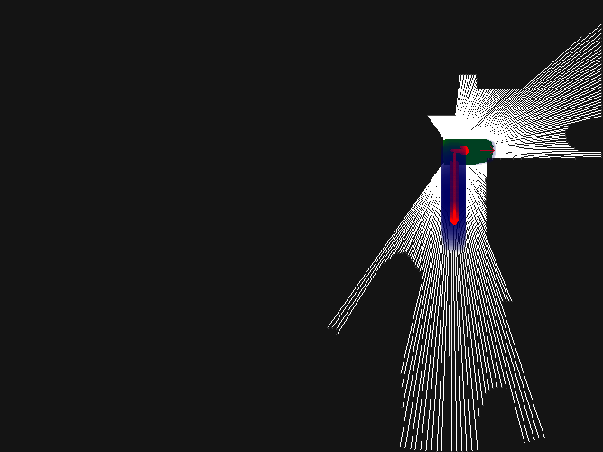

# exp2
Interface for running bc_exploration frontier-cased exploration in BrainCorp's gym environment.

# Installation
Before cloning the repository make sure that you have installed `pipenv`.

```shell
git clone --recursive https://github.com/arashasgharivaskasi-bc/exp2.git
cd exp2
bash easy_install.sh
```

Now you can run exp2/run_frontiers_in_gym.py

# Demo

